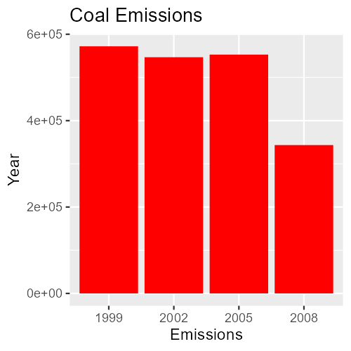

# Exploratory Data Analysis: Course Project 2

## Contents
- [Requirements](#Requirements)
  - [Questions](#Questions)
  - [Plots](#Plots)
- [Data](#Data)
  - [Observations set](#observations-set)
  - [Sources Set](#sources-set)
- [Methodology](#Methodology)
  - [Data Cleaning](#data-cleaning)
    - [Dealing with outliers](#dealing-with-outliers)
  - [Total Emissions](#total-emissions)
  - [Baltimore City Emissions](#baltimore-city-emissions)
  - [Type Emissions](#type-emissions)
  - [US Coal Emissions](#us-coal-emissions)
  - [Motor Vehicle Sources](#Motor-Vehicle-Sources)
  - [Baltimore vs LA](#Baltimore-vs-LA)
- [Instructions](#instructions)

## Requirements

### Questions
> You must address the following questions and tasks in your exploratory analysis. For each question/task you will need to make a single plot. Unless specified, you can use any plotting system in R to make your plot.
>1. Have total emissions from PM2.5 decreased in the United States from 1999 to 2008? Using the **base** plotting system, make a plot showing the total PM2.5 emission from all sources for each of the years 1999, 2002, 2005, and 2008.
>2. Have total emissions from PM2.5 decreased in the **Baltimore City, Maryland** ```fips == "24510``` from 1999 to 2008? Use the **base** plotting system to make a plot answering this question.
>3. Of the four types of sources indicated by the ```type (point, nonpoint, onroad, nonroad)``` variable, which of these four sources have seen decreases in emissions from 1999–2008 for **Baltimore City**? Which have seen increases in emissions from 1999–2008? Use the **ggplot2** plotting system to make a plot answer this question.
>4. Across the United States, how have emissions from coal combustion-related sources changed from 1999–2008?
>5. How have emissions from motor vehicle sources changed from 1999–2008 in **Baltimore City**?
>6. Compare emissions from motor vehicle sources in **Baltimore City** with emissions from motor vehicle sources in **Los Angeles County**, California ```fips == "06037"```. Which city has seen greater changes over time in motor vehicle emissions?

### Plots

>For each plot you should:
>- Construct the plot and save it to a PNG file.
>- Create a separate R code file (**plot1.R**, **plot2.R**, etc.) that constructs the corresponding plot, i.e. code in plot1.R constructs the plot1.png plot. Your code file should include code for reading the data so that the plot can be fully reproduced. You must also include the code that creates the PNG file. Only include the code for a single plot (i.e. plot1.R should only include code for producing plot1.png)
>- Upload the PNG file on the Assignment submission page
>- Copy and paste the R code from the corresponding R file into the text box at the appropriate point in the peer assessment.

## Data

The data was provided in a zip file available at [this link](https://d396qusza40orc.cloudfront.net/exdata%2Fdata%2FNEI_data.zip), and contained two _\*.rds_ files. These can be readily read in via ```readRDS("./data/filename")```.

The two files have different purposes: the _summarySCC\_PM25.rds_ file contains the observations, while the _Source\_Classification\_Code.rds_ file provides expanded definitions of terms refered to in the first file.

### Observations set

Our first data set has nearly 6.5 million observations and six variables, described in the assignment requirements:

>- **fips**: a five-digit number (represented as a string) indicating the U.S. County
>- **SCC**: The name of the source as indicated by a digit string (see source code classification table)
>- **Pollutant**: A string indicating the pollutant
>- **Emissions**: Amount of PM2.5 emitted, in tons
>- **type**: The type of source (point, non-point, on-road, or non-road)
>- **year**: The year of emissions recorded

Overall, this data set looks like this:

```
    fips      SCC Pollutant Emissions  type year
4  09001 10100401  PM25-PRI    15.714 POINT 1999
8  09001 10100404  PM25-PRI   234.178 POINT 1999
12 09001 10100501  PM25-PRI     0.128 POINT 1999
16 09001 10200401  PM25-PRI     2.036 POINT 1999
20 09001 10200504  PM25-PRI     0.388 POINT 1999
24 09001 10200602  PM25-PRI     1.490 POINT 1999
```

### Sources set

The first three columns of this data set looks like this:

```
       SCC Data.Category                                                                 Short.Name
1 10100101         Point                   Ext Comb /Electric Gen /Anthracite Coal /Pulverized Coal
2 10100102         Point Ext Comb /Electric Gen /Anthracite Coal /Traveling Grate (Overfeed) Stoker
3 10100201         Point       Ext Comb /Electric Gen /Bituminous Coal /Pulverized Coal: Wet Bottom
4 10100202         Point       Ext Comb /Electric Gen /Bituminous Coal /Pulverized Coal: Dry Bottom
5 10100203         Point                   Ext Comb /Electric Gen /Bituminous Coal /Cyclone Furnace
6 10100204         Point                   Ext Comb /Electric Gen /Bituminous Coal /Spreader Stoker
```
In total, there are 15 columns:

```
 [1] "SCC"                 "Data.Category"       "Short.Name"          "EI.Sector"           "Option.Group"        "Option.Set"         
 [7] "SCC.Level.One"       "SCC.Level.Two"       "SCC.Level.Three"     "SCC.Level.Four"      "Map.To"              "Last.Inventory.Year"
[13] "Created_Date"        "Revised_Date"        "Usage.Notes"        
```

This set is only really necessary in questions 4 & 5, when comparing emissions by source.

## Methodology


### Data cleaning


we'll start by taking a look at the actual data with a ```summary()``` call:
```
     fips               SCC             Pollutant           Emissions            type                year     
 Length:6497651     Length:6497651     Length:6497651     Min.   :     0.0   Length:6497651     Min.   :1999  
 Class :character   Class :character   Class :character   1st Qu.:     0.0   Class :character   1st Qu.:2002  
 Mode  :character   Mode  :character   Mode  :character   Median :     0.0   Mode  :character   Median :2005  
                                                          Mean   :     3.4                      Mean   :2004  
                                                          3rd Qu.:     0.1                      3rd Qu.:2008  
                                                          Max.   :646952.0                      Max.   :2008 
```

Emissions is a bit troubling, as I cannot imagine why the range for emissions would be so great. Before doing anything, I will need to convert the year to a date.

Ultimately, there's little that actually needs to be "cleaned" in this data set. To process this, we need to ensure that:
- Outliers have been dealt with
- We can easily filter for year, location and type

#### Dealing with outliers

Taking a look at the data would be useful, so I've tried to make a quick scatterplot with qplot: with the amount of data, this is exceedingly slow. Others have recommended the package _scattermore_ to speed things up, so I used that instead. The original data is hard to read, so the right chart is a comparison with the log of emissions. (A box plot might be more ordinary in this case, but I'm using scattermore for the sake of speed.)

```R
library(ggplot2)
library(scattermore)
library(patchwork)

pl1 = ggplot(pm0, aes(x=year, y=Emissions)) + geom_scattermore(pointsize = 2)
pl2 = ggplot(pm0, aes(x=year, y=log10(Emissions))) + geom_scattermore(pointsize = 2)
pl1 + pl2
```


Looks as if there are only a handful of high points, but quite a few zeros:

```R
dim(pm0[Emissions > 10000])
dim(pm0[Emissions > 10000])
```
```
[1] 328494      6
[1] 37  6
```

Ultimately I'm not going to do anything regarding the outliers, for a few reasons:
- From the information given, it's not clear that these are errors
- There is no requirement to take such action on the data
- I want the output to look as similar to other outputs as possible


### Total Emissions

[R File](plot1.R)

>1. Have total emissions from PM2.5 decreased in the United States from 1999 to 2008? Using the **base** plotting system, make a plot showing the total PM2.5 emission from all sources for each of the years 1999, 2002, 2005, and 2008.

Originally, I expected this to be a bit more difficult, given the gaps in the years, but our data only includes those years:

```R
unique(pm0[,year])
```
```
[1] 1999 2002 2005 2008
```

This will be the simplest plot to make, as we're just going to be creating a sum for each year, and plotting this sum. We'll use aggregate to sum each year, and plot with the base _barplot_ function. 

```R
pmsum = aggregate(pm0$Emissions, by=list(year=pm0$year),sum)

barplot(pmsum$emissions,pmsum$year, names=pmsum$year,
        xlab = "Year", ylab = "Emissions", 
        main = "Total Emissions by Year")
```


### Baltimore City Emissions

[R File](plot2.R)

>2. Have total emissions from PM2.5 decreased in the **Baltimore City, Maryland** ```fips == "24510``` from 1999 to 2008? Use the **base** plotting system to make a plot answering this question.

This won't be much more difficult than the above: we'll read in the data, filter it by the fips code given above, and spit out a bar chart. We'll just need to amend the code above with:

```R
balt = pm0[fips == "24510"]
```
And we'll fetch a graph using the values in "balt". Adding a bit of color for color.


### Type Emissions

[R File](plot3.R)

>3. Of the four types of sources indicated by the ```type (point, nonpoint, onroad, nonroad)``` variable, which of these four sources have seen decreases in emissions from 1999–2008 for **Baltimore City**? Which have seen increases in emissions from 1999–2008? Use the **ggplot2** plotting system to make a plot answer this question.

This question is a bit more involved, as it requires a different package. Thankfully, the ggplot2 package is easy to use, and I've preferred it to the base plotting system. Filtering is the tricky part: there are two ways to do this, one is a bit more readable than the other:

```R
balt = pm0[fips == "24510"]
balt = group_by(balt,year,type)
balt = summarize(balt,Emissions = sum(Emissions))
```
Or, equivalently:
```R
balt = pm0 %>% filter(fips == "24510") %>% group_by(year,type) %>% summarize(Emissions = sum(Emissions))
```

Now, we feed this into ggplot2, using facets to plot points. I'm using the ```factor``` arguement for year, as without, ggplot2 wanted to plot the points halfway between years, rather than on the dot. geom_col will take care of most column-related measurements.

```R
bplot = ggplot(balt, aes(x = factor(year), y = Emissions)) + geom_col() + facet_grid(. ~ type)
```


### US Coal Emissions

[R File](plot4.R)

>4. Across the United States, how have emissions from coal combustion-related sources changed from 1999–2008?

We're finally getting to the utility of the SCC dataset, so we'll need to take a look at that to understand what SC codes are related to coal. Searching among columns, _EI.Sector_ classifies each type of data source, so we'll filter this using the dplyr package.

```R
coal = scc %>% filter(grepl('Coal', EI.Sector, ignore.case = T))
```
This churns out a nice list of 99 codes. We'll subset the dataset looking for only matches with those codes:
```R
coal = subset(pm0, pm0$SCC %in% coal$SCC)
```
From here, we'll be using the same techniques as we did in the last question to put together a plot. We'll aggregate the data by year, and create a plot with ggplot2.

```R
coalagg = aggregate(coal$Emissions, by = list(Year = coal$year), sum)

coalplot = ggplot(coalagg, aes(x = factor(Year), y = x))
coalplot + labs(title = "Coal Emissions", x = "Emissions",  y = "Year") + geom_col(fill = "red")
```




### Motor Vehicle Sources

[R File](plot5.R)

>5. How have emissions from motor vehicle sources changed from 1999–2008 in **Baltimore City**?

This question is the same as the above, asking for a different source and filtering by city. We'll start by looking at the codes available to us in scc:

```R
unique(scc$EI.Sector)
```
```
...                  
[21] Mobile - On-Road Gasoline Light Duty Vehicles      Mobile - On-Road Gasoline Heavy Duty Vehicles     
[23] Mobile - On-Road Diesel Light Duty Vehicles        Mobile - On-Road Diesel Heavy Duty Vehicles       
[25] Mobile - Non-Road Equipment - Gasoline             Mobile - Non-Road Equipment - Other               
[27] Mobile - Non-Road Equipment - Diesel               Mobile - Aircraft                                 
[29] Mobile - Commercial Marine Vessels                 Mobile - Locomotives                              
...
59 Levels: Agriculture - Crops & Livestock Dust Agriculture - Fertilizer Application Agriculture - Livestock Waste ... Waste Disposal
```

59 Levels, of which 21-30 are in regards to mobility. We _could_ sort these by hand, but thankfully, all vehicles contain the term "Vehicles", which is easy to grep for.

```R
carcodes = scc %>% filter(grepl('Vehicles', EI.Sector, ignore.case = T))
cars = pm0 %>% filter(fips == "24510" & pm0$SCC %in% carcodes$SCC) 
```
with this filtered set, I'd like to include the _EI.Sector_ values from scc, so we can see how the types of vehicle emissions have changed over the years. We'll start out by making the sector types more readable, as the original values are quite long:
```R
carcodes$EI.Sector = as.character(carcodes$EI.Sector)
carcodes$EI.Sector[carcodes$EI.Sector == "Mobile - On-Road Gasoline Light Duty Vehicles"] <- "Light Gas"
carcodes$EI.Sector[carcodes$EI.Sector == "Mobile - On-Road Gasoline Heavy Duty Vehicles"] <- "Heavy Gas"
carcodes$EI.Sector[carcodes$EI.Sector == "Mobile - On-Road Diesel Light Duty Vehicles"] <- "Light Diesel"
carcodes$EI.Sector[carcodes$EI.Sector == "Mobile - On-Road Diesel Heavy Duty Vehicles"] <- "Heavy Diesel"
carcodes$EI.Sector = as.factor(carcodes$EI.Sector)
```
What we need from the data is the category that we just made, the emissions total, and the year, and we'll need to match the data between two data frames. I'll start by reducing _carcodes_ to just the EI.Sector and SCC for the sake of brevity. Later, I'll build a new data frame, pulling emissions and year from the original cars data frame, and using ```match()``` to match sc codes in cars with sc codes in carcodes, and return the second column (the named category) in carcodes where there is a match.

```R
carcodes = carcodes[c("SCC","EI.Sector")]
cars = data.frame(Emissions = cars$Emissions,Cat = carcodes[match(cars$SCC,carcodes$SCC),2], Year = cars$year)
head(cars)
```
```
  Emissions       Cat Year
1      7.38 Light Gas 1999
2      2.78 Light Gas 1999
3     11.76 Light Gas 1999
4      3.50 Light Gas 1999
5      1.32 Light Gas 1999
6      5.58 Light Gas 1999
```

From here, it's the same process as we did earlier to group by category and summarise.

```R
carsagg = cars %>% group_by(Year, Cat) %>% summarize(Emissions = sum(Emissions))

carplot = ggplot(carsagg, aes(x = factor(Year), y = Emissions)) + geom_col(fill = "blue")
carplot + facet_grid(. ~ Cat)
```


### Baltimore vs LA

[R File](plot6.R)

>6. Compare emissions from motor vehicle sources in **Baltimore City** with emissions from motor vehicle sources in **Los Angeles County**, California ```fips == "06037"```. Which city has seen greater changes over time in motor vehicle emissions?

For the sake of readability, we'll use overall totals between LA and Boston, which simplifies things greatly:

```R
bost = pm0 %>% filter(fips == "24510" & pm0$SCC %in% carcodes$SCC) 
la = pm0 %>% filter(fips == "06037" & pm0$SCC %in% carcodes$SCC) 


bostagg = aggregate(bost$Emissions, by = list(Year = bost$year), sum)
laagg = aggregate(la$Emissions, by = list(Year = la$year), sum)
```

The ```patchwork()``` package makes short work of combining the graphs.

```R
library(patchwork)
bostplot = ggplot(bostagg, aes(x = factor(Year), y = x)) + geom_col(fill = "blue") + labs(title = "Boston", x = "Year", y = "Emissions")
laplot = ggplot(laagg, aes(x = factor(Year), y = x)) + geom_col(fill = "red") + labs(title = "LA", x = "Year", y = "Emissions")
bostplot + laplot
```


## Instructions

1. This project relies on the libraries _dplyr_, _ggplot2_, and _patchwork_, so these must be installed for the project to function properly. This can be done with a console command: ```install.packages("dplyr")```, and so on.
2. This README provides greater detail to each of the associated files and the methodology, each associated _*.R_ file is linked below the chapter heading.
3. Results can be duplicated by executing the _*.R_ file associated with each chapter.